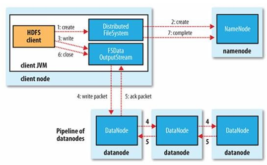
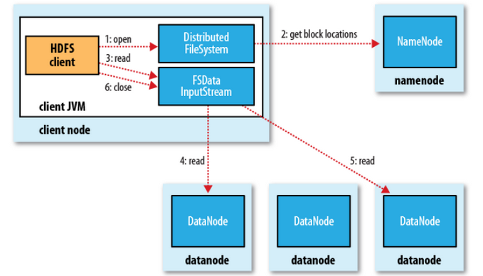

## 1.HDFS  API示例
### 1.1 Client API
1）准备工作
本人习惯使用Ubuntu，ide工具则是idea，如果是windows系统或者eclipse自行百度吧，我没有试过。

老套路，创建Maven工程，导入依赖
```
    <dependencies>
        <dependency>
            <groupId>junit</groupId>
            <artifactId>junit</artifactId>
            <version>4.12</version>
        </dependency>
        <dependency>
            <groupId>org.apache.logging.log4j</groupId>
            <artifactId>log4j-slf4j-impl</artifactId>
            <version>2.12.0</version>
        </dependency>
        <dependency>
            <groupId>org.apache.hadoop</groupId>
            <artifactId>hadoop-client-api</artifactId>
            <version>3.1.3</version>
        </dependency>
        <dependency>
            <groupId>org.apache.hadoop</groupId>
            <artifactId>hadoop-client-runtime</artifactId>
            <version>3.1.3</version>
        </dependency>
```
在resources下添加日志配置文件“log4j2.xml”
```
<?xml version="1.0" encoding="UTF-8"?>
<Configuration status="error" strict="true" name="XMLConfig">
    <Appenders>
        <Appender type="Console" name="STDOUT">

            <Layout type="PatternLayout"
                    pattern="[%p] [%d{yyyy-MM-dd HH:mm:ss}][%c{10}]%m%n" />
        </Appender>

    </Appenders>

    <Loggers>
        <Logger name="test" level="info" additivity="false">
            <AppenderRef ref="STDOUT" />
        </Logger>

        <Root level="info">
            <AppenderRef ref="STDOUT" />
        </Root>
    </Loggers>
</Configuration>
```

2）在src/main/java下创建包cn.leaf。可以随意，之后创建类HdfsClient，客户端的使用大致如下
```
    public void hdClient() throws IOException, InterruptedException {
        // 获得一个客户端对象
        URI uri = URI.create("hdfs://hadoop10:9820");
        Configuration conf = new Configuration();
        String user = "v2admin";
        FileSystem fs = FileSystem.get(uri,conf,user);
        // TODO 执行操作
        
        // 关闭资源
        fs.close();
    }
```

### 1.2 上传文件示例代码
```
    public static void main(String[] args) throws IOException, InterruptedException {
        // 获得一个客户端对象
        URI uri = URI.create("hdfs://hadoop10:9820");
        Configuration conf = new Configuration();
        String user = "v2admin";
        FileSystem fs = FileSystem.get(uri,conf,user);
        // TODO 执行操作
        Path upsrc = new Path("/home/zhaow/桌面/Shell/passwd.txt");
        Path updst = new Path("/home");
        upFile(fs,upsrc,updst);
        
        // 关闭资源
        fs.close();
    }

    /**
     * 上传文件
     * @param fs Client对象
     * @param src 待上传文件
     * @param dst hdfs 路径
     */
    public static void upFile(FileSystem fs, Path src, Path dst){
        try {
            fs.copyFromLocalFile(src, dst);
        } catch (IOException e) {
            e.printStackTrace();
        }
    }
```


### 1.3 下载文件示例代码
```
    /**
     * 下载文件
     * @param fs 客户端对象
     * @param src 待下载的文件路径，也就是HDFS上的文件路径
     * @param dst 目标路径
     */

    public static void downFile(FileSystem fs, Path src, Path dst){
        try {
            fs.copyToLocalFile(false,src,dst);
        } catch (IOException e) {
            e.printStackTrace();
        }
    }
```

## 2 读写流程
### 2.1写文件流程
通过代码完成了文件上传，那么这中间HDFS是怎样完成文件的写入的呢？
流程如下图所示:
 

途中包含以下角色
Client、Distributed FileSystem、FSData InputStream、NameNode、DataNode，除了Distributed FileSystem、FSData InputStream两个角色外，其他已经在之前说过。

Distributed FileSystem，翻译过来就是分布式文件系统。
FSDataOutputStream就是一个输出流对象。

1）Client向HDFS写数据的时，文件是分块存储在HDFS的各个DataNode节点上，而存储位置的是NameNode规定的，所以Client 在上传文件时需要先和NameNode进行交互。

Client首先调用Distributed FileSystem的create方法，然后远程调用NameNodeNode的create()。
NameNode的检查是否已存在文件、检查权限。若通过检查，直接先将操作写入Edits文件Client，返回FSDataOutputStream。

2）Client 开始切分文件，请求上传，然后从NameNode获取上传到的DataNode节点信息，假定是d1，d2,d3三个节点。

3）client通过FSDataOutputStream对象调用write()写数据，具体流程如下：
请求dn1上传数据，d1收到请求会继续调用d2，然后d2调用d3，完成传输通道的建立。

4）client向d1上传第一个block（从磁盘读取数据先放到一个本地内存缓存），以Packet为单位，d1收到一个Packet就会传给d2，d2传给d3；d1每传一个packet会放入一个应答队列等待应答。
5）当完成整个文件的写入后，执行FSDataOutputStream的close()方法，同时告知NameNode我完成了文件写入操作。


### 2.2 读文件流程

 

同样client通过Distributed FileSystem向NameNode请求下载文件，NameNode查询元数据得到下载文件所在的DataNode节点信息。
存储该文件的节点有很多，会优先选择一个最近的节点，发起请求。
DataNode开始传输数据给客户端。
Client以Packet为单位接收，先在本地缓存，然后写入目标文件。
