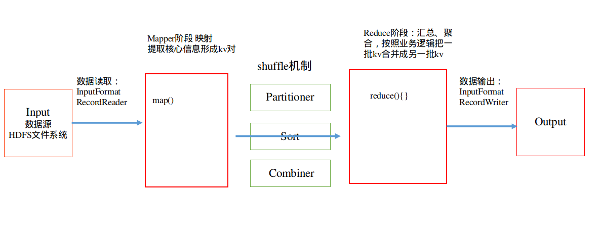

# 1.完整的MapReduce程序
一个完整的MapReduce程序在分布式运行中包含两类实例进程：
1）MrAppMaster ：负责整个程序运行过程的调度及状态协调
2）YarnChild：负责Map阶段的整个数据处理流程
3）YarnChild：负责Reduce阶段的整个数据处理流程。
MapTask和ReduceTask都是跑在YarnChild的进程中，当然是各自的YarnChild进程。


# 2.MapReduce的数据流示意图
 

1）一个mr程序已启动，首先启动MrAppMaster，它负责整个程序的过程调度及状态协调。
2）MrAppMaster根据job的描述信息，计算出需要MapTask的数量n，然后申请启动n个MapTask进程。
3）MapTask启动后，从InputFormat获得RecordReader，（RecordReader封装了输入的数据），从中读取数据，以kv对的形式传递到map()方法中，再将map()输出的kv对加到缓存中保存，之后将缓存中kv对按照k进行分区排序，溢写到磁盘文件。
4）MrAppMaster监控所有MapTask进程，当发现所有MapTask进程完成任务，去启动指定数量的ReduceTask进程，分配ReduceTask进程要处理的数据分区。
5）ReduceTask进程启动后，从若干个MapTask获取若干个输出结果文件，在本地进行归并排序，将相同的key的kv分为一个组，调用reduce()方法进行逻辑处理，最后出结果kv，调用OutputFormat将结果输出到指定位置。

当然实际当中，并不是直接使用InputFormat，而是使用FileInputFormat的实现类，常见的实现类TextInputFormat、KeyValueTextInputFormat、NLineInputFormat、CombineTextInputFormat和自定义InputFormat等。
OutputFormat同样，使用的是它实现类，像TextOutputFormat或者自定义实现。

## 3.InputFormat
InputFormat 负责Map端数据的输入
```
public abstract class InputFormat<K, V> {
    public InputFormat() {
    }

    public abstract List<InputSplit> getSplits(JobContext var1) throws IOException, InterruptedException;

    public abstract RecordReader<K, V> createRecordReader(InputSplit var1, TaskAttemptContext var2) throws IOException, InterruptedException;
}
```
源码中两个方法
getSplits(): 生成切片信息。
createRecordReader(): 负责输入数据的读取处理

这是一个抽象类，不能直接使用，InputFormat有一个子抽象类FileInputFormat，它继承了InputFormat，具体实现了getSplits()方法，也是Hadoop的默认切片实现规则。

**FileInputFormat**的切片机制
1）简单的按照文件的内容长度进行切片
2）切片大小默认等于Block大小，默认Block在2.x和3.x版本为128M
3）切片时不考虑数据集整体，而是逐个针对每一个文件单独切片
核心实现过程就在getSplits()方法中。

举个示例：
20201120.log  200M
20201121.log 100M

切片完成后：
20201120.log.split1	0-128
20201120.log split2	128-200
20201121.log.split1	100M


**FileInputFormat**实现类
FileInputFormat常见的接口实现类包括：TextInputFormat、KeyValueTextInputFormat等。
- TextInputFormat：默认的FileInputFormat实现类。按行读取每条记录。键是存储该行在整个文件中的起始字节偏移量， LongWritable类型。值是这行的内容，不包括任何行终止符（换行符和回车符），Text类型。
- 2.KeyValueTextInputFormat 每一行均为一条记录，被分隔符分割为key，value。可以通过在驱动类中设置conf.set(KeyValueLineRecordReader.KEY_VALUE_SEPERATOR, "\t");来设定分隔符。默认分隔符是tab

当然还有其他实现类NLineInputFormat、CombineTextInputFormat等，我们也可以自己实现。