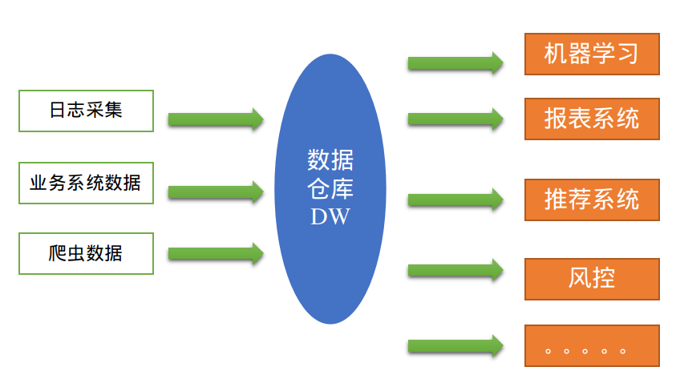
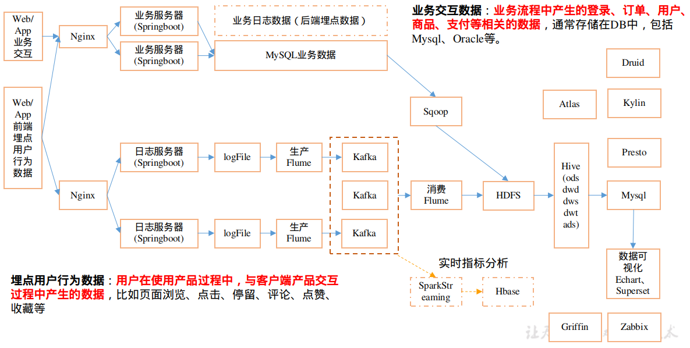
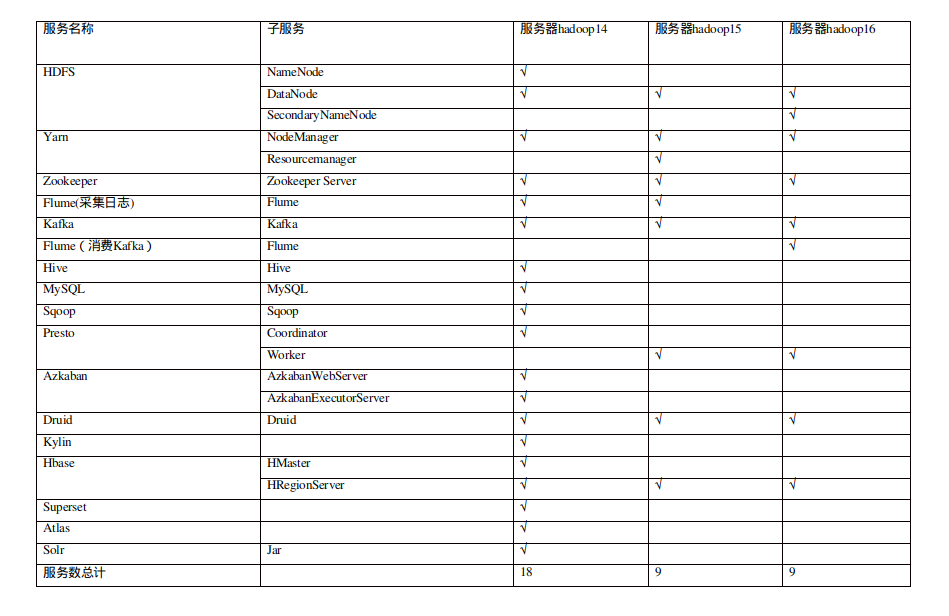
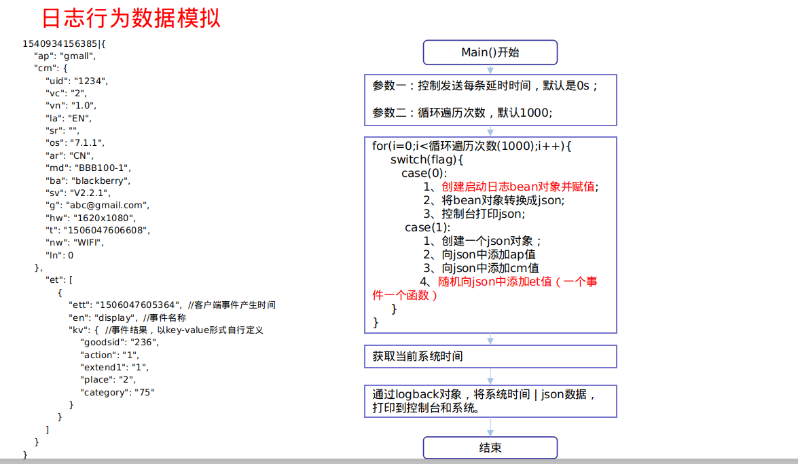

```
---
layout: post
title: '数据仓库'
date: 2020-01-10-01
author: leafgood
color: rgb(98,170,255)
tags: 离线数仓
---
```

# 一.数据仓库概述
什么是数据仓库？
数据仓库，英文名称为Data Warehouse，可简写为DW或DWH，是为企业所有级别的决策制定过程，提供所有类型数据支持的战略集合。
那它与数据库有什么区别呢？
数据库，Database，主要用于事务处理，而数据仓库DWH主要用于数据分析。

如下图所示

 

# 二.项目需求
1.用户行为数据采集平台搭建
2.业务数据采集平台搭建
3.数据仓库维度建模
4.分析，用户、流量、会员、商品、销售、地区、活动等电商核心主题，统计的报表指标近100个。完全对比中型公司。
5.采用即时查询工具，随时进行指标分析
6.对集群性能进行监控，发生异常需要报警
7.元数据管理
8.质量监控

# 三.项目框架
## 3.1 技术选型
技术选型主要考虑因素：数据量大小、业务需求、行业内经验、技术成熟度、开发维护成本、总成本预算
1）数据采集传输：Flume，Kafka，Sqoop ，Logstash，DataX
2）数据存储：MySql，HDFS，HBase，Redis，MongoDB
3）数据计算：Hive，Tez， Spark， Flink，Storm
4）数据查询：Presto，Druid ，Impala，Kylin
5）数据可视化：Echarts、Superset、Tableau、QuickBI、DataV
6）任务调度：Azkaban、Oozie
7）集群监控：Zabbix
8）元数据管理: Atlas

## 3.2 系统数据流程设计
 

## 3.3 框架版本选择
- 1）Apache框架版本

|产品 |	版本|
| -- | -- |
|Hadoop	 |2.7.2/3.1.3 |
|Flume	|1.7.0/1.9.0 |
|Kafka	|0.11.0.2/2.4.1|
|Hive |	2.3/3.1 |
| Sqoop|	1.4.6 |
|MySQL	| 5.6.24 |
|Azkaban	|2.5.0 |
|Java	|1.8|
|Zookeeper	|3.4.10/3.5.7|
|Presto	|0.189|

- 2)CDH 框架版本

|产品 |	版本|
| -- |  -- |
Hadoop |	2.6.0
Spark	|1.6.0
Flume|	1.6.0
Hive |	1.1.0
Sqoop |	1.4.6
Oozie |	4.1.0
Zookeeper |	3.4.5
Impala |	2.9.0

*框架选型尽量不要选择最新的框架，选择最新框架半年前左右的稳定版*

## 3.4 服务器选型
物理机 or 云主机

## 3.5 集群规模
如何确认集群规模？假设：每台服务器8T磁盘，128G内存。
1）每日活跃用户100万，每人一天平均100条数据：
100万×100条=1亿条
2）每条日志1k左右，每天1亿条：1亿*1024*1024 = 约为100G
3）半年内不扩容服务器的话：100G×180天 约为 18T
4）保存3副本：18T×3 54T
5）预留20%到30%buf=54T/0.7 = 77T
6）算到这里：约为8T×10台服务器
那如果考虑数据仓库分层、数据压缩，还得重新计算。

## 3.5 测试集群规划
 

## 3.6 数据生成模块
注意，这个只是用来生成数据便于学习或者测试，生产环境中用的是真实数据。
 
