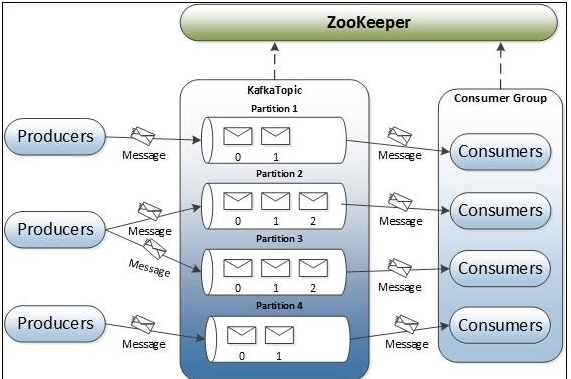

# 一.Kafka概述
## 1.1 消息队列简介
消息队列就是一个存放消息的容器(MQ)，当我们需要使用消息的使用可以从中取出消息。
主要类型有两种，点对点消息队列和发布-订阅者消息队列.

- 1.点对点消息队列
消息生产者生产消息发送到消息队列中，然后消息消费者从Queue中取出并且消费消息。
消息被消费以后，Queue中不再有存储，所以消息消费者不可能消费到已经被消费的消息。
点对点消息队列模式支持存在多个消费者，但是对一个消息而言，只会有一个消费者可以消费。

- 2.发布-订阅消息队列
消息生产者（发布）将消息发布到topic中，同时有多个消息消费者（订阅）消费该消息。和点对点方式不同，发布到topic的消息会被所有订阅者消费。数据被消费后不会立马删除。在发布-订阅消息系统中，消息的生产者称为发布者，消费者称为订阅者。

## 1.2 kafka介绍
Kafka是一个分布式的基于发布/订阅模式的消息队列，具有高性能、持久化、多副本备份、横向扩展能力。生产者往队列里写消息，消费者从队列里取消息进行业务逻辑。一般在架构设计中起到解耦、削峰、异步处理的作用。
主要应用场景是：日志收集系统和消息系统。

## 1.3 Kafka术语
在理解kafa之前，先了解下kafka的术语，见下图
 
1）broker
kafka急群众包含一个或多个服务器，服务器节点就称之为broker。

2）Topic
每条发布到kafk的消息都有一个类别，这个类别就是topic。
物理上不同Topic的消息分开存储，逻辑上一个Topic的消息虽然保存于一个或多个broker上但用户只需指定消息的Topic即可生产或消费数据而不必关心数据存于何处

3）Partition
topic中的数据会被分割为一个或者多个Partition。每个topic至少一个Partition。
每个Partition中的数据使用多个segment文件存储。Partition中的数据是有序的，但不同的Partition间的数据丢失数据的顺序，如果topic有多个Partition，那消费数据时不能保证数据的顺序，在需要严格保证消息顺序的场景下，Partition数据需要设置为1.

4）Producer
生产者，就数据的发布者，它将数据发布到kafka的topic中。
broker接受到发布者发送的消息数据，将该消息追加到当前用于追加数据的segment中。
发布者发送的消息，存储到一个Partition中，生产者也可以指定数据存储的Partition。

5）Consumer
消费者也就是订阅者，从broker中读取数据，消费者可以读取多个topic中的数据。

6）Consumer Group
每个Consumer属于一个特定的Consumer Group。

7）Leader
每个Partition有多个副本，其中有且仅有一个作为Leader，Leader负责当前数据读写。

8）Follower
Follower跟随Leader，所有读写请求都通过Leader，数据变更会广播给所有Follower，Follower与Leader保持数据同步。
如果Leader失效，则从Follower中选举出一个新的Leader。当Follower与Leader挂掉、卡住或者同步太慢，leader会把这个follower从“in sync replicas”（ISR）列表中删除，重新创建一个Follower。

# 二.为什么使用kafka
当然更准确的说，为什么要使用队列？kafka只是我们选择的队列。
## 2.1 解耦
举一个例子，我们有一个A系统，它要把数据发到B、C两个系统，这时候来了一个需求，D系统说“我也需要A系统的数据，你发过来吧”，负责A系统的程序员开始改代码，没有费多少力气，修改好了。
过了两天，D系统说“我现在不需要A系统的数据了。”
A：“。。。。”
又过了两天，D系统“A系统，不行啊，我还是得需要你的数据。”
周而复始，负责A系统的程序员“心态崩了。。。”

那我们现在引入了Kafka，当然这并不只是Kafka的优势，其他消息队列同样可以实现解耦哦，具体根据业务情况来选择，这里只说kafka。

有了kafka后，现在A的数据只发送到kafka中，其他人想要使用数据从kafka中取就是了。
这样A系统就跟其他系统解耦了。

## 2.2 异步通信
假定这样一个场景，还是A系统，从浏览器接受了一个请求，在自己本地写库，速度1ms，之后需要BC两系统也要写库，但速度要慢，B系统需要600ms，C系统需要500ms，这个时候用户从浏览器发起请求到得到相应需要1ms+600ms+800ms，那用户体验肯定不好。

但使用消息队列可以实现异步解耦
A系统获得请求后，发送两条消息到消息队列，假定只要2ms完成，之后A就可以响应用户了，总共耗时1ms+2ms，也就是3ms，那用户体验肯定不差，这就是异步通信。

## 2.3 冗余
有些情况下，处理数据的过程可能会失败，这时候数据除非被持久化，佛足额就会丢失。
消息队列把数据进行持久化，直到他们已经被完全处理，通过这种方式规避了数据丢失的风险。

## 2.4 削峰
还是举例，平常A系统，每秒并发量也就是100左右，这时赶上双11，并发量可是能突增到50k以上，这对系统还有数据库的压力可是极大的，搞不好就把系统搞崩溃了。
就像我们mysql，每秒2000多的并发请求就
但是双11一过，又回到日常100左右并发。

这时候，我引入消息队列，请求先进入消息队列中，假定每秒5k个，A系统从消息队列拉取请求，每秒处理3k个，消息队列以5k个请求进入，3k个请求被拉取出去，这样就可以顶住高峰时期的访问压力，不会因为突发的超高峰负荷导致系统崩溃。

## 2.5 可恢复性
A系统把数据发到消息队列中，B从消息队列中拉取数据，突然B挂掉了，但队列中保存的数据还在，所以当B恢复后，还可以继续处理之前的数据。

# 3.常用MQ介绍
## 3.1 RabbitMQ
RabbitMQ是使用Erlang编写的一个开源的消息队列，支持很多的协议：AMQP，XMPP, SMTP, STOMP。
它支持多种语言，Python、Java、Ruby、C、PHP等，支持事务、发布确认和消息持久化。
那个很火的Openstack中用到的就是RabbitMQ。

## 3.2 Redis
Redis是一个NoSql数据库，基于k-v对，虽然是一个k-v的NoSql数据，但本身支持MQ功能。
同样很多语言都支持Redis，像会话缓存、消息队列，还有活动排行榜等。
对于RabbitMQ和Redis的入队和出列性能测试，对两者出入队操作，各执行100万次，每10万次记录一次执行时间，测试数据分别为128Bytes、512Bytes、1K和10K四个不同大小的数据。
结果表明：
入队时，当数据比较小时Redis的性能要高于RabbitMQ，而如果数据大小超过了10K，Redis则慢的无法忍受；
出队时，无论数据大小，Redis都表现出非常好的性能，而RabbitMQ的出队性能则远低于Redis。

在选择MQ时，要结合实际业务情况来选择。
Redis是轻量级、高并发、延迟敏感，在做缓存、即时数据分析等场景可以考虑。

## 3.3 ActiveMQ
性能比较差，版本迭代慢，现在使用的应该不多了。

## 3.4 RocketMQ
阿里出品，Java系开源项目，
参考文档：http://rocketmq.apache.org/

## 3.5 Kafka
Apache下的一个子项目，这是一个分布式发布/订阅消息队列系统，我们hadoop生态中，就使用kafka。
