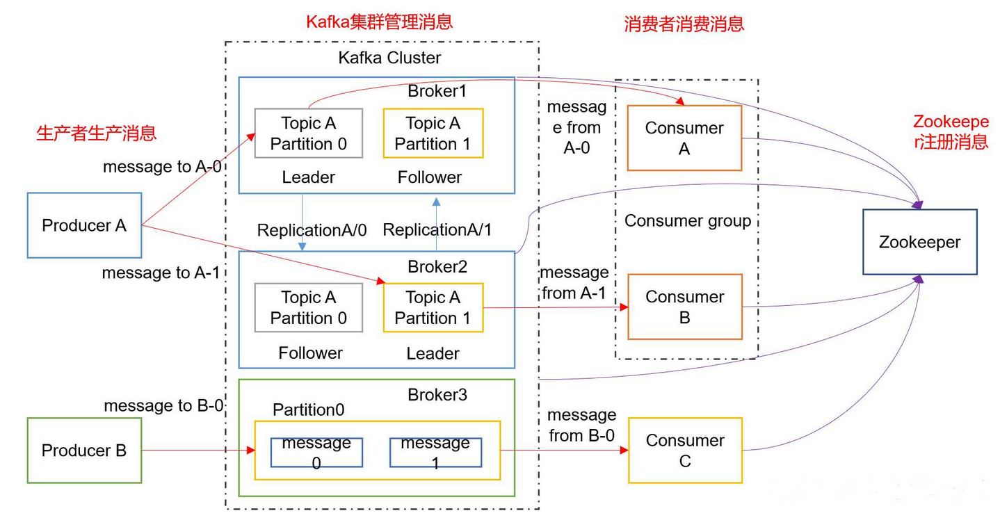
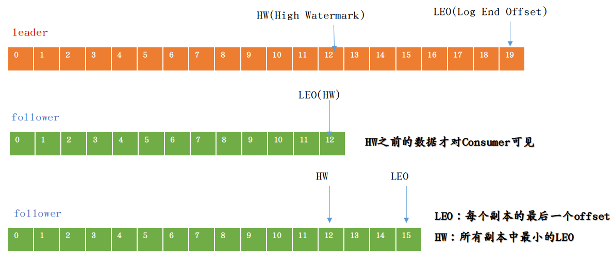

# 一.kafka命令行操作
## 1.1 创建topic
```
[v2admin@hadoop10 kafka]$ bin/kafka-topics.sh --zookeeper hadoop10:2181  --create --replication-factor 2 --partitions 1 --topic  first
Created topic first.
```
## 1.2 查看topic
```
[v2admin@hadoop10 kafka]$ bin/kafka-topics.sh --zookeeper hadoop10:2181 --list
demo
first
```

## 1.3 删除topic
```
[v2admin@hadoop10 kafka]$ bin/kafka-topics.sh --zookeeper hadoop10:2181 -delete --topic first
Topic first is marked for deletion.
Note: This will have no impact if delete.topic.enable is not set to true.
```
## 1.4 发送消息
```
[v2admin@hadoop10 kafka]$ bin/kafka-console-producer.sh --broker-list hadoop10:9092 --topic demo
>hello
>world
>haha
>women
>tintian
```
## 1.5 消费消息
```
[v2admin@hadoop11 kafka]$ bin/kafka-console-consumer.sh --bootstrap-server hadoop10:9092 --from-beginning --topic demo
world
women
hello
haha
tintian
```
## 1.6 查看某个topic
```
^C[v2admin@hadoop11 kafka]$ bin/kafka-topics.sh --zookeeper hadoop10:2181 --describe --topic demo
Topic: demo	PartitionCount: 2	ReplicationFactor: 2	Configs: 
	Topic: demo	Partition: 0	Leader: 11	Replicas: 11,12	Isr: 12,11
	Topic: demo	Partition: 1	Leader: 12	Replicas: 12,10	Isr: 10,12
```

# 二.Kafka架构图
 

一个典型的Kafka集群由以下角色组成：
1）若干Producer，可以是web前端产生的Page View，或者是服务器日志，系统CPU、Memory等，
2）若干broker（Kafka支持水平扩展，一般broker数量越多，集群吞吐率越高）
3）若干Consumer Group
4）一个Zookeeper集群

Kafka通过Zookeeper管理集群配置，选举leader，以及在Consumer Group发生变化时进行rebalance。Producer使用push模式将消息发布到broker，Consumer使用pull模式从broker订阅并消费消息。


Kafka中消息是以topic进行分类的，生产者生产消息，消费者消费消息，都是面向topic的。
首先明确的是，topic是逻辑上的概念，而partition则是物理上的概念，每个partition对应于一个log文件，该log文件中存储的就是producer生产的数据。

Producer生产的数据会被不断追加到该log文件末端，且每条数据都有自己的offset。

消费者组中的每个消费者，都会实时记录自己消费到了哪个offset，以便出错恢复时，从上次的位置继续消费。

生产者生产的消息会不断追加到log文件末尾，这样log文件会不断增大，为防止log文件过大导致数据定位效率低下，Kafka采取了分片和索引机制，将每个partition分为多个segment。
每个segment对应两个文件——“.index”文件和“.log”文件。
如下就是示例
```
-rw-rw-r--. 1 v2admin v2admin 10485760 1月   6 21:17 00000000000000000000.index
-rw-rw-r--. 1 v2admin v2admin        0 1月   6 21:17 00000000000000000000.log
-rw-rw-r--. 1 v2admin v2admin 10485756 1月   6 21:17 00000000000000000000.timeindex
-rw-rw-r--. 1 v2admin v2admin        8 1月   6 21:17 leader-epoch-checkpoint
```
# 三.分区原则
通过前面知道，Producer生产的数据进入kafka中，会保存到一个topic中，但topic是逻辑上的概念，实际上，一个topic中，在物理是分割成一个或者多个Partition保存的。

那生产者的数据是怎么进行分区的？这个分区原则是什么？
Producer发送的数据封装成一个ProducerRecord对象，我们来看下API中，它的源码
```
public ProducerRecord(String topic, Integer partition, Long timestamp, K key, V value, Iterable<Header> headers) {
        if (topic == null) {
            throw new IllegalArgumentException("Topic cannot be null.");
        } else if (timestamp != null && timestamp < 0L) {
            throw new IllegalArgumentException(String.format("Invalid timestamp: %d. Timestamp should always be non-negative or null.", timestamp));
        } else if (partition != null && partition < 0) {
            throw new IllegalArgumentException(String.format("Invalid partition: %d. Partition number should always be non-negative or null.", partition));
        } else {
            this.topic = topic;
            this.partition = partition;
            this.key = key;
            this.value = value;
            this.timestamp = timestamp;
            this.headers = new RecordHeaders(headers);
        }
    }

    public ProducerRecord(String topic, Integer partition, Long timestamp, K key, V value) {
        this(topic, partition, timestamp, key, value, (Iterable)null);
    }

    public ProducerRecord(String topic, Integer partition, K key, V value, Iterable<Header> headers) {
        this(topic, partition, (Long)null, key, value, headers);
    }

    public ProducerRecord(String topic, Integer partition, K key, V value) {
        this(topic, partition, (Long)null, key, value, (Iterable)null);
    }

    public ProducerRecord(String topic, K key, V value) {
        this(topic, (Integer)null, (Long)null, key, value, (Iterable)null);
    }

    public ProducerRecord(String topic, V value) {
        this(topic, (Integer)null, (Long)null, (Object)null, value, (Iterable)null);
    }
    
```
1）在指定Partition时，直接将Partition的值作为Partition值
2）在没指定Partition时，但指定了key的情况下，则将key的hash与topic的Partition值进行取余，得到的值作为Partition值
3）都没有指定情况下，第一次调用就随机生成一个整数，后面每次调用在这个整数上自增。
这个随机整数与topic可用的Partition总数取余得到Partition值，这个也就是roundp-robin算法。

# 四.数据可靠性
Producer发送的数据，如何保证能够到达指定的topic？可靠性如何保证？
topic的每个partition收到producer发送的数据后，都要向producer发送ack，表示确认收到，如果producer收到ack，就会进行下一轮的发送，否则重新发送数据。

那ack什么时候发送呢？
有以下两种同步策略

|方案	| 优点 |	缺点 |
| -- | -- | -- |
| 半数以上完成同步，就发送ack |	延迟低	| 选举新的leader时，容忍n台节点的故障，需要2n+1个副本 |
|全部完成同步，才发送ack|	选举新的leader时，容忍n台节点的故障，需要n+1个副本|	延迟高 |

kafka采用了第二种方案，
1）如果是第一种方案，为了容忍n个节点的故障，第一种方案需要2n+1个副本，而第二种方案则需要n+1个副本，Kafka的每个分区都有大量的数据，那第一种方案会造成大量数据的冗余，资源浪费。
2）第二种方案的网络延迟会比较高，不过网络延迟对Kafka的影响不大，可以忽略不计。

kafka采用第二种方案后，那还有一个问题，
那看下这个场景，leader收到数据，这时候所有follower开始同步数据，但这个过程中，有一个follower，因为某种原因(本身故障或者网络故障缘故等)，长时间不能与leader进行同步，那leader就要一直等下去，直到它完成同步，才能发送ack。
为了解决这个问题，Leader维护了一个动态的in-sync replica set (ISR)，意为和leader保持同步的follower集合。当ISR中的follower完成数据的同步之后，leader就会给producer发送ack。如果follower长时间未向leader同步数据，则该follower将被踢出ISR，该时间阈值由**replica.lag.time.max.ms**参数设定。Leader发生故障之后，就会从ISR中选举新的leader。

但还有一个问题，有些时候，我们发送的数据并不是那么多重要，对可靠性要求也就不高，所以没必要等ISR中的Follower全部接收成功。
Kafka提供三种可靠级别，我们可以自行选择：

|   acks参数   |   描述 |
|  --  | -- |
|0 | producer不等待broker的ack，这一操作提供了一个最低的延迟，broker一接收到还没有写入磁盘就已经返回，当broker故障时有可能丢失数据；|
|1 | producer等待broker的ack，partition的leader落盘成功后返回ack，如果在follower同步成功之前leader故障，那么将会丢失数据；|
| -1（all）| producer等待broker的ack，partition的leader和follower全部落盘成功后才返回ack。但是如果在follower同步完成后，broker发送ack之前，leader发生故障，那么会造成数据重复。|


那么具体故障是如何处理的呢？如下图示例
 

| 故障 |  处理细节 |
| --- | --- |
Follower故障  | follower发生故障，会被临时踢出ISR，待该follower恢复后，follower会读取本地磁盘记录的上次的HW，并将log文件高于HW的部分截取掉，从HW开始向leader进行同步。等该follower的LEO大于等于该Partition的HW，即follower追上leader之后，就可以重新加入ISR了|
| Leader故障 | leader发生故障之后，会从ISR中选出一个新的leader，之后，为保证多个副本之间的数据一致性，其余的follower会先将各自的log文件高于HW的部分截掉，然后从新的leader同步数据。|

# 五.Exactly Once和事务
将服务器ACK级别设置为0，可以保证生产者每条消息只会被发送一次，即At Most Once语义，但不能保证数据不丢失。
将服务器的ACK级别设置为-1，可以保证Producer到Server之间不会丢失数据，即At Least Once语义，但不不能保证数据不重复。

这就尴尬了，我们对于一些重要的数据，既要保证数据不丢失，也要保证数据不重复，也就是Exactly Once语义。

在0.11版本之前的Kafka是没啥办法的，只能在生产者发送数据保证数据不丢，然后在消费者时，对数据去重。
在0.11版本之后的Kafka引入一个特性：幂等性，就是用户对于同一操作发起的一次请求或者多次请求的结果是一致的，不会因为多次点击而产生了副作用。
在kafka中，就是指Producer不论向Server发送多少次重复数据，Server端都只会持久化一条。
幂等性与At Least Once结合，就构成kafka的Exactly Once语义：
At Least Once + 幂等性 = Exactly Once

启动幂等性，要将Producer的参数中enable.idompotence设置为true即可。
开启幂等性的Producer在初始化的时候会被分配一个PID，发往同一Partition的消息会附带Sequence Number。而Broker端会对<PID, Partition, SeqNumber>做缓存，当具有相同主键的消息提交时，Broker只会持久化一条。

但是注意，不同的Partition也有不同主键，所以幂等性无法保证跨分区的Exactly Once，而且PID重启也会发生变化。

那这个怎么解决？就是事务，事务，就是要么全成功，要么全失败，kafka从0.11版本开始引入事务支持，这个事务可以保证Kafka在Exactly Once语义基础上，生产和消费者可以跨分区和会话，要么全成功，要么全失败。
1）Producer事务
为了实现跨分区跨会话的事务，这里引入一个全局唯一的Transaction ID，并将Producer获得的PID和Transaction ID绑定。这样当Producer重启后就可以通过正在进行的Transaction ID获得原来的PID。
为了管理Transaction，Kafka引入了一个新的组件Transaction Coordinator。
Producer就是通过和Transaction Coordinator交互获得Transaction ID对应的任务状态。
Transaction Coordinator还负责将事务所有写入Kafka的一个内部Topic，这样即使整个服务重启，由于事务状态得到保存，进行中的事务状态可以得到恢复，从而继续进行。

2）Consumer事务
对于Consumer而言，事务的保证就会相对较弱，很难保证Commit的信息被精确消费。
这是因为Consumer可以通过offset访问任意信息，而不同的Segment File生命周期不同，同一事务的消息可能会出现重启后被删除的情况。
解决这个问题，下一章Kafka API上会说。

# 六.Consumer消费者
## 6.1 消费方式
Consumer采用pull模式从broker中读取数据。
为什么不采用push模式呢？
因为采用push模式，消息发送速率由broker决定，所以push模式很难适应消费速率不同的Consumer。
比方说，push模式下
broker的推送消息速率每秒100条，但Consumer处理消息的速率是每秒10条，那每秒就有90条消息来不及处理，典型的后果就是拒绝服务、网络堵塞。
采用pull模式，Consumer可以根据自己的消费能力以适当的速率消费消息。

pull模式也有不足之处，那就是broker没有数据，Consumer很可能会陷入循环中，一直返回空数据。
针对这一点，Kafka的消费者在消费数据时会传入一个时长参数timeout，如果当前没有数据可供消费，consumer会等待一段时间之后再返回，这段时长即为timeout。

## 6.2 分区分配策略
一个topic中有多个Partition，一个Consumer group中也会有多个Consumer，哪个Partition由哪个Consumer来处理？这就是Partition的分配问题。
kafka中有两种分配方式，round-robin和range。
1）round-bin 轮询分区
比如我1,2,3,4,5,6,7条数据，有a、b、c三个消费者，那怎么分配呢？
这种模式下这样分配
1给a，2给b，3给c，4给a，5给b，6给c，7给a，就这样轮询分配。
最后分配
a：1,4,7  ；  b：2,5   c：3,6

2）range模式
假如有10个分区，3个消费者，把分区按照序号排列0，1，2，3，4，5，6，7，8，9；消费者为a,b,c，那么用分区数除以消费者数来决定每个Consumer消费几个Partition，除不尽的前面几个消费者将会多消费一个
最后分配结果如下

a：0，1，2，3
b：4，5，6
c：7，8，9

如果有11个分区将会是：

C1：0，1，2，3
C2：4，5，6，7
C3：8，9，10

假如我们有两个主题T1,T2，分别有10个分区，最后的分配结果将会是这样：

C1：T1（0，1，2，3） T2（0，1，2，3）
C2：T1（4，5，6） T2（4，5，6）
C3：T1（7，8，9） T2（7，8，9）

在这种情况下，C1多消费了两个分区

## 6.3 offset
consumer在消费过程中可能会出现断电宕机等故障，consumer恢复后，需要从故障前的位置的继续消费，所以consumer需要实时记录自己消费到了哪个offset，以便故障恢复后继续消费。
Kafka 0.9版本之前，consumer默认将offset保存在Zookeeper中，从0.9版本开始，consumer默认将offset保存在Kafka一个内置的topic中，该topic为__consumer_offsets。

## 6.4 Zookeeper的作用
Kafka集群中broker的上线下线、topic的分区副本分配、Leader的选举等等，这些需要有一个角色来管理，这个角色就是Controller，Controller是从集群中的broker中选举出来的，这个Controller的工作是依赖Zookeeper完成的。


