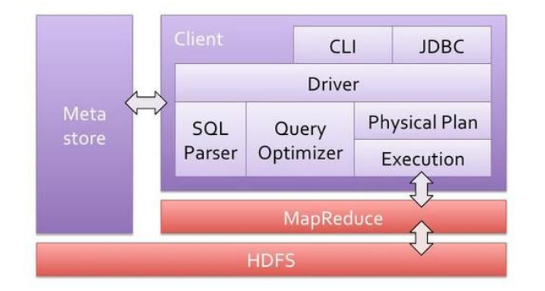
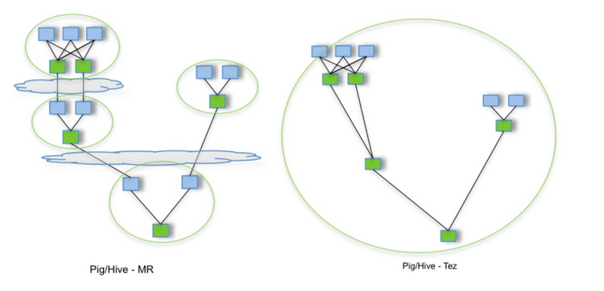

# 1.概述
## 1.1 Hive是不是数据库？
Hive是由Facebook开源用于解决海量结构化日志的数据统计工具。
它是基于Hadoop的一个数据仓库工具，能够将结构化的数据文件映射为一张表，并提供类SQL查询功能，我们一般叫HQL(Hive Sql)，
底层是存储在HDFS上。

Hive的本质是将SQL语句转换为MapReduce任务运行，所以Hive它不是数据库，而是基于Hadoop的一个数据仓库工具。

## 1.2 使用Hive的原因？
HIve提供了友好的接口，我们可以使用类似SQL的语法，免去了写MapReduce，这减少了开发人员的学习成本，为我们提供快速开发的能力。

学习MapReduce还得花点功夫，但SQL可是我们必备的能力哦。

## 1.3 Hive的特点
1）操作接口采用类SQL语法，简单容易上手
2）避免写MapReduce，减少学习成本
3）Hive执行延迟比较高，适合用于数据分析，对实时性要求不高的场景。
为什么Hive执行延迟高？一是因为Hive在查询数据时没有索引，需要扫描整表，另外一个就是MapReduce本就具有较高的延迟。
4）Hive在处理大数据有很大优势，但对于数据不打的场景，就没有多少必要使用Hive，因为Hive延迟比较高。

5）Hive支持自定义函数
6）Hive扩展性高，可自由扩展集群的规模
7）Hive容错性不错，能保证即使有节点问题，SQL语句仍然可以执行。
8）Hive不支持记录级别的增删改操作
9）Hive不支持事务

## 1.4 Hive架构
 

1）Client：用户接口
JDBC/ODBC访问Hive
Web浏览器访问Hive
CLI，Shell终端命令行
2）Driver：驱动器
驱动引擎，由四部分构成，解析器、编译器、优化器和执行器，这也是Hive的核心所在
解析器（SQL Parser）：将SQL字符串转换成抽象语法树AST
编译器（Physical Plan）：将AST编译生成逻辑执行计划。
优化器（Query Optimizer）：对逻辑执行计划进行优化。
执行器（Execution）：把逻辑执行计划转换成可以运行的物理计划。对于Hive来说，就是MR/Spark。

3）MetaStore
元数据，就是存储HIve中的数据的描述信息，
Hive中的元数据包括：表名、表所属的数据库（默认是default）、表的拥有者、列/分区字段、表的类型（是否是外部表）、表的数据所在目录等。

元数据默认存储在自带的derby数据库中，但通常我们使用MySQL存储Metastore。

4）Hadoop
底层使用HDFS存储，使用MR进行计算。

工作流程：
Hive通过给用户提供的一系列交互接口，接收到用户的指令(SQL)，使用自己的Driver，结合元数据(MetaStore)，将这些指令翻译成MapReduce，提交到Hadoop中执行，最后，将执行返回的结果输出到用户交互接口。


# 2.安装
这个还是老套路，了解这个东东是什么，就得装一个，然后进一步深入，那么开始安装Hive
官方网站 [http://hive.apache.org/](http://hive.apache.org/) 

## 2.1 安装MySQL
两个方式
### 2.1.1 yum安装
直接yum install mysql-server ，如果没有可用包，那就按下边的方式来
1）下载Mysql的repo源
```
wget http://repo.mysql.com/mysql-community-release-el7-5.noarch.rpm 
```
2） 安装mysql repo源
```
rpm -ivh mysql-community-release-el7-5.noarch.rpm
```
3）安装mysql
```
yum install mysql-server
```
### 2.1.2 下载rpm包安装
我的版本5.7 mysql-5.7.28-1.el7.x86_64.rpm-bundle.tar
1）解压
```
 tar -xf mysql-5.7.28-1.el7.x86_64.rpm-bundle.tar
```
2）安装
```
rpm -ivh mysql-community-common-5.7.28-1.el7.x86_64.rpm
rpm -ivh mysql-community-libs-5.7.28-1.el7.x86_64.rpm
rpm -ivh mysql-community-libscompat-5.7.28-1.el7.x86_64.rpm
rpm -ivh mysql-community-client-5.7.28-1.el7.x86_64.rpm
rpm -ivh mysql-community-server-5.7.28-1.el7.x86_64.rpm
```
以上两种方式CentOS，如果Ubuntu可以用apt install 来安装

## 2.2 安装Hive
1）从官网获取安装包，我的的版本是3.1.2 apache-hive-3.1.2-bin.tar.gz，并拷贝的服务器上
2）解压并改名
```
tar -zxvf apache-hive-3.1.2-bin.tar.gz -C /opt
cd /opt
mv  apache-hive-3.1.2-bin/ /opt/hive
```
3）配置环境变量/etc/profile
```
#HIVE_HOME
export HIVE_HOME=/opt/hive
export PATH=$PATH:$HIVE_HOME/bin
```
4）防止日志jar包冲突
```
 mv $HIVE_HOME/lib/log4j-slf4j-impl-2.10.0.jar $HIVE_HOME/lib/log4j-slf4j-impl-2.10.0.old
```
## 2.3 元数据配置为Mysql
1）拷贝mysql jdbc驱动到hive的lib目录下
```
cp mysql-connector-java-5.1.48.jar $HIVE_HOME/lib
```

2）配置MetaStore到MySQL
在hive的conf目录下新建hive-site.xml文件，添加如下配置
```
<?xml version="1.0"?>
<?xml-stylesheet type="text/xsl" href="configuration.xsl"?>
<configuration>
    <!-- jdbc连接的URL -->
    <property>
        <name>javax.jdo.option.ConnectionURL</name>
        <value>jdbc:mysql://hadoop10:3306/metastore?useSSL=false</value>
</property>

    <!-- jdbc连接的Driver-->
    <property>
        <name>javax.jdo.option.ConnectionDriverName</name>
        <value>com.mysql.jdbc.Driver</value>
</property>

	<!-- jdbc连接的username-->
    <property>
        <name>javax.jdo.option.ConnectionUserName</name>
        <value>root</value>
    </property>

    <!-- jdbc连接的password -->
    <property>
        <name>javax.jdo.option.ConnectionPassword</name>
        <value>12345678</value>
    </property>
    <!-- Hive默认在HDFS的工作目录 -->
    <property>
        <name>hive.metastore.warehouse.dir</name>
        <value>/user/hive/warehouse</value>
    </property>
    
   <!-- Hive元数据存储版本的验证 -->
    <property>
        <name>hive.metastore.schema.verification</name>
        <value>false</value>
    </property>
    <!-- 指定存储元数据要连接的地址 -->
    <property>
        <name>hive.metastore.uris</name>
        <value>thrift://hadoop10:9083</value>
    </property>
    <!-- 指定hiveserver2连接的端口号 -->
    <property>
    <name>hive.server2.thrift.port</name>
    <value>10000</value>
    </property>
   <!-- 指定hiveserver2连接的host -->
    <property>
        <name>hive.server2.thrift.bind.host</name>
        <value>hadoop10</value>
    </property>
    <!-- 元数据存储授权  -->
    <property>
        <name>hive.metastore.event.db.notification.api.auth</name>
        <value>false</value>
    </property>

</configuration>
```

## 2.4 安装Tez引擎
为什么安装这个?因为Tez引擎性能优于MR。
两者的对比，如下图
 
假设有四个有依赖关系的MR作业（1个较为复杂的Hive SQL可能被翻译成4个有依赖关系的MR作业），运行过程如下，其中，绿色是Reduce Task，需要写HDFS，云状表示写屏蔽（write barrier，一种内核机制，持久写）。

Tez可以将多个有依赖的作业转换为一个作业（这样只需写一次HDFS，且中间节点较少），从而提升性能。

1）首先准备安装包 http://tez.apache.org，然后上传至服务端
我的版本tez-0.10.1- minimal SNAPSHOT.tar.gz

2）解压
```
tar -zxvf tez-0.10.1- minimal SNAPSHOT.tar.gz -C /opt/tez
```
3）上传依赖至HDFS
```
hadoop fs -mkdir /tez
hadoop fs -put /opt/software/tez-0.10.1-SNAPSHOT.tar.gz /tez
```
4）在Hadoop目录etc/hadoop下新建tez-site.html，然后添加如下配置
```
<?xml version="1.0" encoding="UTF-8"?>
<?xml-stylesheet type="text/xsl" href="configuration.xsl"?>
<configuration>
<property>
	<name>tez.lib.uris</name>
    <value>${fs.defaultFS}/tez/tez-0.10.1-SNAPSHOT.tar.gz</value>
</property>
<property>
     <name>tez.use.cluster.hadoop-libs</name>
     <value>true</value>
</property>
<property>
     <name>tez.am.resource.memory.mb</name>
     <value>1024</value>
</property>
<property>
     <name>tez.am.resource.cpu.vcores</name>
     <value>1</value>
</property>
<property>
     <name>tez.container.max.java.heap.fraction</name>
     <value>0.4</value>
</property>
<property>
     <name>tez.task.resource.memory.mb</name>
     <value>1024</value>
</property>
<property>
     <name>tez.task.resource.cpu.vcores</name>
     <value>1</value>
</property>
</configuration>
```
保存

5）切换到目录
$HADOOP_HOME/etc/hadoop/shellprofile.d下载
vim tez.sh
```
hadoop_add_profile tez
function _tez_hadoop_classpath
{
    hadoop_add_classpath "$HADOOP_HOME/etc/hadoop" after
    hadoop_add_classpath "/opt/tez/*" after
    hadoop_add_classpath "/opt/tez/lib/*" after
}
```
保存

6）修改hive的计算引擎
vim $HIVE_HOME/conf/hive-site.xml 
添加如下
```
<property>
    <name>hive.execution.engine</name>
    <value>tez</value>
</property>
<property>
    <name>hive.tez.container.size</name>
    <value>1024</value>
</property>
```
7）日志jia包冲突解决
```
mv /opt/tez/lib/slf4j-log4j12-1.7.10.jar  /opt/tez/lib/slf4j-log4j12-1.7.10.jar.old
```

到此安装完成。


# 3.启动Hive
## 3.1 元数据初始化
1）登录mysql，并创建数据库 metastore，然后退出
```
mysql>create database metastore；
mysql>quit；
```
2）初始化元数据
```
schematool -initSchema -dbType mysql -verbose
```
3）编写启动脚本 vim hive_server.sh
```
#!/bin/bash
HIVE_LOG_DIR=$HIVE_HOME/logs

mkdir -p $HIVE_LOG_DIR

#检查进程是否运行正常，参数1为进程名，参数2为进程端口
function check_process()
{
    pid=$(ps -ef 2>/dev/null | grep -v grep | grep -i $1 | awk '{print $2}')
    ppid=$(netstat -nltp 2>/dev/null | grep $2 | awk '{print $7}' | cut -d '/' -f 1)
    echo $pid
    [[ "$pid" =~ "$ppid" ]] && [ "$ppid" ] && return 0 || return 1
}

function hive_start()
{
    metapid=$(check_process HiveMetastore 9083)
    cmd="nohup hive --service metastore >$HIVE_LOG_DIR/metastore.log 2>&1 &"
    cmd=$cmd" sleep4; hdfs dfsadmin -safemode wait >/dev/null 2>&1"
    [ -z "$metapid" ] && eval $cmd || echo "Metastroe服务已启动"
    server2pid=$(check_process HiveServer2 10000)
    cmd="nohup hive --service hiveserver2 >$HIVE_LOG_DIR/hiveServer2.log 2>&1 &"
    [ -z "$server2pid" ] && eval $cmd || echo "HiveServer2服务已启动"
}

function hive_stop()
{
    metapid=$(check_process HiveMetastore 9083)
    [ "$metapid" ] && kill $metapid || echo "Metastore服务未启动"
    server2pid=$(check_process HiveServer2 10000)
    [ "$server2pid" ] && kill $server2pid || echo "HiveServer2服务未启动"
}

case $1 in
"start")
    hive_start
    ;;
"stop")
    hive_stop
    ;;
"restart")
    hive_stop
    sleep 2
    hive_start
    ;;
"status")
    check_process HiveMetastore 9083 >/dev/null && echo "Metastore服务运行正常" || echo "Metastore服务运行异常"
    check_process HiveServer2 10000 >/dev/null && echo "HiveServer2服务运行正常" || echo "HiveServer2服务运行异常"
    ;;
*)
    echo Invalid Args!
    echo 'Usage: '$(basename $0)' start|stop|restart|status'
    ;;
esac
```
4）添加执行权限 并启动
```
chmod a+x hive_server.sh
hive_server.sh start
```
5）验证下
```
[v2admin@hadoop10 ~]$ hive_cons.sh status
Metastore服务运行正常
HiveServer2服务运行正常
```
## 3.2 客户端连接
beeline -u jdbc:hive2://hadoop10:10000 -n v2admin // 替换成自己的地址和用户名即可
示例
```
[v2admin@hadoop10 conf]$ beeline -u jdbc:hive2://hadoop10:10000 -n v2admin
Connecting to jdbc:hive2://hadoop10:10000
Connected to: Apache Hive (version 3.1.2)
Driver: Hive JDBC (version 3.1.2)
Transaction isolation: TRANSACTION_REPEATABLE_READ
Beeline version 3.1.2 by Apache Hive
0: jdbc:hive2://hadoop10:10000> 
```

## 3.3 hive -e 不进入客户端交互模式执行sql
```
hive -e "select id,name form emp;"
```

## 3.5 hive -f 执行脚本中sql语句
```
hive -f example.sql  // example.sql 为写sql的文件 
```
## 3.4 查看命令帮助
```
[v2admin@hadoop10 conf]$ hive -help
SLF4J: Class path contains multiple SLF4J bindings.
SLF4J: Found binding in [jar:file:/opt/module/hbase/lib/slf4j-log4j12-1.7.25.jar!/org/slf4j/impl/StaticLoggerBinder.class]
SLF4J: Found binding in [jar:file:/opt/module/hadoop-3.1.3/share/hadoop/common/lib/slf4j-log4j12-1.7.25.jar!/org/slf4j/impl/StaticLoggerBinder.class]
SLF4J: See http://www.slf4j.org/codes.html#multiple_bindings for an explanation.
SLF4J: Actual binding is of type [org.slf4j.impl.Log4jLoggerFactory]
Hive Session ID = b6480949-d94e-48da-8278-09e87e2ca986
usage: hive
 -d,--define <key=value>          Variable substitution to apply to Hive
                                  commands. e.g. -d A=B or --define A=B
    --database <databasename>     Specify the database to use
 -e <quoted-query-string>         SQL from command line
 -f <filename>                    SQL from files
 -H,--help                        Print help information
    --hiveconf <property=value>   Use value for given property
    --hivevar <key=value>         Variable substitution to apply to Hive
                                  commands. e.g. --hivevar A=B
 -i <filename>                    Initialization SQL file
 -S,--silent                      Silent mode in interactive shell
 -v,--verbose                     Verbose mode (echo executed SQL to the
                                  console)

```
