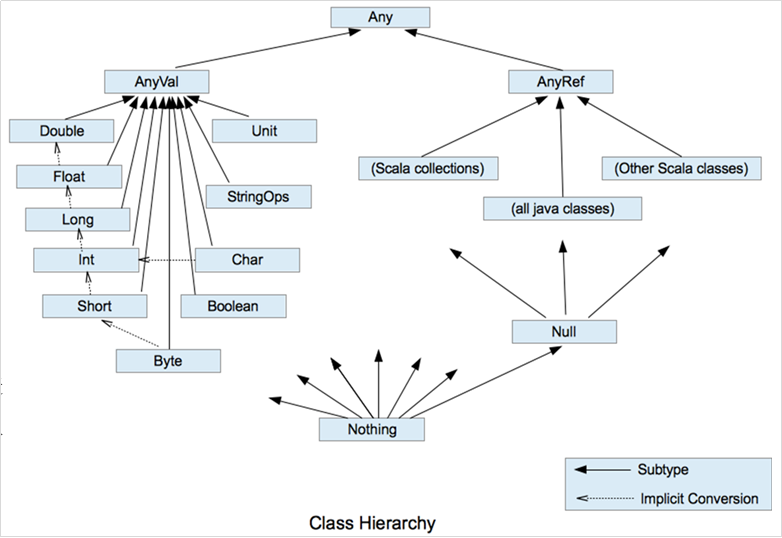

# 一.Scala 概述
## 1.1 什么是Scala
Scala编程语言是由联邦理工学院洛桑（EPFL）的Martin Odersky于2001年基于Funnel的工作开始设计并开发的。由于Martin Odersky之前的工作是开发通用Java和Javac（Sun公司的Java编译器），所以基于Java平台的Scala语言于2003年底/2004年初发布。

Scala是一门可伸缩的软件编程语言，体现了面向对象，函数式编程等多种不同的语言范式，且融合了不同语言新的特性。

Scala官网 https://www.scala-lang.org/

## 1.2 学习Scala的目的
1)大数据主要的批处理计算引擎框架Spark是基于Scala语言开发的
2)大数据主要的流式计算引擎框架Flink也提供了Scala相应的API
3)大数据领域中函数式编程的开发效率更高，更直观，更容易理解

## 1.3 安装
### 1.3.1 安装jdk(1.8以上版本)
略
### 1.3.2 安装Scala
在官网上下载，我这里是Ubuntu系统，选择版本为scala-2.12.11.tgz
安装很简单
1）解压文件
2）将解压后的目录放置在指定目录
```
# 我这里是/usr/local 目录
mv scala-2.12.11 /usr/local/
```
3）配置环境变量
/etc/profile 追加如下内容
```
# set scala
export SCALA_HOME=/usr/local/scala-2.12.11
export PATH=${PATH}:${SCALA_HOME}/bin
```
执行source /etc/profile

4）测试下
如下显示，表示安装成功
```
(base) zhaow@zhaow-610:~$ scala
Welcome to Scala 2.12.11 (Java HotSpot(TM) 64-Bit Server VM, Java 11.0.1).
Type in expressions for evaluation. Or try :help.
scala> 

```
# 二.Scala 基本语法
## 2.1 第一个Scala程序 HelloWorld
学习编程语言，第一个入门程序，必然是HelloWorld.scala
```
object HelloWorld {
  def main(args: Array[String]): Unit = {
   // 打印HelloWorld
    println("Hello World!")
  }

}
```
然后进行编译
```
scalac HelloWorld.scala
```
编译之后生成两个文件,
```
HelloWorld.class
HelloWorld$.class
```
运行HelloWorld.class
```
scala HelloWorld
```
输出结果HelloWorld

## 2.2 注释
Scala注释与Java注释完全一样
```
/**
 * 文档注释
 */
object HelloWorld {
  def main(args: Array[String]): Unit = {
    // 单行注释
    /*
     多行注释1
     多行注释2
     */
    println("Hello World!")
  }

}
```
## 2.3 标识符
Scala使用的标识符有两种形式：字符数字和符号
- 字符数字使用字母或是下划线开头，后面可以接字母或是数字，符号"$"在 Scala 中也看作为字母。然而以"$"开头的标识符为保留的 Scala 编译器产生的标志符使用，应用程序应该避免使用"$"开始的标识符，以免造成冲突。
- Scala 的命名规则采用和 Java 类似的 camel 命名规范，首字符小写，比如 toString。类名的首字符还是使用大写。此外也应该避免使用以下划线结尾的标志符以避免冲突。
- Scala 内部实现时会使用转义的标志符，比如:-> 使用 $colon$minus$greater 来表示这个符号。

代码示例
```
object Scala_Indentifier {
  def main(args: Array[String]): Unit = {
    // 默认情况下，scala标识符声明方式和java一致
    val name = "张三"
    val user_age = 14
    val address1 = "BJ"
    val _sex = "男"
    val $emain = "123@123.com"
//    val 1name = "张三" //错误示范
//    val class = "张三" // 错误示范

    // Scala 标识符可以使用符号进行声明，但常见语法操作的符号是不能使用的
    // 例如(),[],"",''
    val + = "张三"
    val - = "张三"
    val * = "张三"
    val / = "张三"
//    val ( = "张三" // error
    

  }

}
```
## 2.4 数据类型与类型转换
### 2.4.1 数据类型
Scala是完全面向对象的语言，所以不存在基本数据类型的概念，有的只是任意值对象类型（AnyVal）和任意引用对象类型(AnyRef)
如下图所示
 

| 数据类型 | 描述 |
| -- | -- |
Byte  |	8位有符号补码整数。数值区间为 -128 到 127
Short |	16位有符号补码整数。数值区间为 -32768 到 32767
Int 	|32位有符号补码整数。数值区间为 -2147483648 到 2147483647
Long |	64位有符号补码整数。数值区间为 -9223372036854775808 到 9223372036854775807
Float  |	32位IEEE754单精度浮点数
Double | 	64位IEEE754单精度浮点数
Char  |	16位无符号Unicode字符, 区间值为 U+0000 到 U+FFFF
String  |	字符序列
Boolean  |	true或false
Unit  |	表示无值，和其他语言中void等同。用作不返回任何结果的方法的结果类型。Unit只有一个实例值，写成()。
Null  |	null 或空引用
Nothing | 	Nothing类型在Scala的类层级的最低端；它是任何其他类型的子类型。
Any  |	Any是所有其他类的超类
AnyRef  | 	AnyRef类是Scala里所有引用类(reference class)的基类

### 2.4.2 类型转换
1）自动类型转换
```
object ScalaDataType {
  def main(args: Array[String]): Unit = {
    // Scala 自动类型转换
    // 例如Byte类型和Short类型的自动转换
    val byte_num = 11
    val short_num = byte_num
    val i_num:Int = short_num
 

  }
}
```

2）强制类型转换
```
object ScalaDataType {
  def main(args: Array[String]): Unit = {

    // 将精度打的类型转换为精度小的类型
    // Scala中使用方法进行转换
    val i_num = 12
    val b_num = i_num.toByte
    // 基本上Scala的AnyVal类型之间都提供了相应转换的方法
  }
}
```
3）字符串类型转换
scala是完全面向对象的语言，所有的类型都提供了toString方法，可以直接转换为字符串


## 2.5 变量
1）语法声明
```
object ScalaVariable {
  def main(args: Array[String]): Unit = {
    // 声明方式1 var 变量名:变量类型 = 变量值
    var name1:String = "张三"
    // 声明方式2 val 变量名:变量类型 = 变量值
    val name2:String = "张三"
    // var 和 val 声明方式不同之处
    // var 声明方式 变量可以修改，为可变变量
    name1 = "王五"
    // val 声明方式 变量不可以修改，为不可变变量
    name2 = "王五" // 错误
  }
}
```
2）精简书写
```
object ScalaVariable {
  def main(args: Array[String]): Unit = {
    // 完整声明规则
    val name1:String = "张三"
    // 其中数据类型可以不指定，这时候，则会进行数据类型的推断
    val name2 = "张三"
    println(name2.getClass.getSimpleName) // 输出结果为String
  }
}

```
3）总结

- 声明变量时，数据类型可以指定，也可以不指定，如果不指定，那么就会进行数据类型的推断。

- 如果指定数据类型，数据类型的执行 方式是 在变量名后面写一个冒号，然后写上数据类型。

- scala里面变量的修饰符有两个，var和val。
	- 如果是var修饰的变量，那么这个变量的值是可以修改的。
	- 如果是val修饰的变量，那么这个变量的值是不可以修改的。

## 2.5 字符串
Scala中，字符串的类型实际上就是Java中的String
我们从String的源码可以看到这一点
```
type String        = java.lang.String
```
String是不可变的字符串对象，不可被修改，这与Java一致，修改时，会产生一个新的字符串对象。

### 2.5.1 字符串连接
```
object Scala_string {
  def main(args: Array[String]): Unit = {
    val name:String = "张三"
    val sex:String = "男"
    println(name+":"+sex)
  }
}
```

### 2.5.2 字符串传值
代码示例
```
object Scala_string {
  def main(args: Array[String]): Unit = {
    val name = "张三"
    // 使用printf格式化字符串
    printf("name=%s",name)
  }
}
```

### 2.5.3 字符串插值和多行字符串
代码示例
```
object Scala_string {
  def main(args: Array[String]): Unit = {
    // 字符串插值
    val name = "张三"
    println(s"name=$name")
    
    // 多行字符串格式，在封装SQL或者JSON比较常用
    // | 默认顶格符
    println(
      s"""
         |select
         |*
         |from
         |demo_tb
         |""".stripMargin)
    
    
  }
}
```

## 2.6 运算符
scala运算符的使用和Java运算符的使用基本相同，只是Scala中运算符实际上是方法。
示例
```
object ScalaOper {
  def main(args: Array[String]): Unit = {
    val i = 10
    // val j = i + 10 // 实际上执行的是方法
    val j = i.+(10)
    println(j)
  }

}
```

## 2.7 流程控制
### 2.7.1 分支语句
代码示例
```
object Scala_Flow {
  def main(args: Array[String]): Unit = {
    // 单分支
    val num = 91
    if(num>100){
      println("num 大于 100")
    }

    // 双分支
    if(num>100){
      println("num 大于 100")
    }else{
      println("num 不大于 100")
    }

    // 多分支
    if(num>100){
      println("num 大于 100")
    }else if(num > 90){
      println("num 大于 90 ，且小于等于100")
    }else{
      println("num....")
    }

  }
}
```
另外if条件表达式是有返回值的，返回值会根据条件表达式的情况自动进行数据类型推断
代码示例
```
object Scala_Flow {
  def main(args: Array[String]): Unit = {
    val age = 20
    val res = if(age > 20) 1 else 0
    println(res)
  }
}
```
### 2.7.2 循环语句
1）for循环

- 基本语法
```
for ( 循环变量 <- 数据集 ) { // 这里的数据集可以是任意类型的数据集合，如字符串，集合，数组等
    循环体
}
```
代码示例
```
object Scala_Loop {
  def main(args: Array[String]): Unit = {
    // 示例1
    for(i <- Range(1,5)){ // 左闭右开，不包含5
      println("i========="+i)
    }
    // 示例2
    for(i <- 1 to 5){ // 包含5
      println("i=========="+i)
    }

    // 示例3
    for(i <- 1 until 5){ // 不包含5
      println("i======="+i)
    }

  }
}
```

- 循环时增加条件判断
代码示例
```
object Scala_Loop {
  def main(args: Array[String]): Unit = {
    for(i <- Range(1,30) if (i%2)==0){
      println("i========"+i)
    }

  }
}
```
- 循环步长
```
object Scala_Loop {
  def main(args: Array[String]): Unit = {
    for(i <- Range(1,10,2)){
      println("i=========="+i)
    }
    for(i <- 1 to 10 by 2){
      println("i========="+i)
    }

  }
}
```

- for 循环推导
```
object Scala_Loop {
  def main(args: Array[String]): Unit = {
    // for 循环推导式:
    // 如果for训话中的循环体以yield开始，则该循环会构建一个集合，每次迭代会生成集合中的一个值
    val value = for(i <- 1 to 5) yield i * 20
    println(value)
  }
}
```

2）while循环
- 基本语法
```
while( 循环条件表达式 ) {
    循环体
}
```

- 代码示例
```
object Scala_Loop {
  def main(args: Array[String]): Unit = {
    var i = 0
    while (i < 5){
      println("i========="+i)
      i+=1
    }
  }
}
```
3）中断循环
Scala是完全面向对象的语言，无法使用break、continue这样的关键字。
Scala采用函数式编程的方式代替了循环语法中的break
示例
```
import scala.util.control.Breaks

object Scala_Loop {
  def main(args: Array[String]): Unit = {
    Breaks.breakable{
      for(i <- 1 to 5){
        if( i==3 ){
          Breaks.break
        }
      }
    }
  }
}

```
也可以这样导包，简化书写
```
import scala.util.control.Breaks._

object Scala_Loop {
  def main(args: Array[String]): Unit = {
    breakable{
      for(i <- 1 to 5){
        if( i==3 ){
          break
        }
      }
    }
  }
}
```

